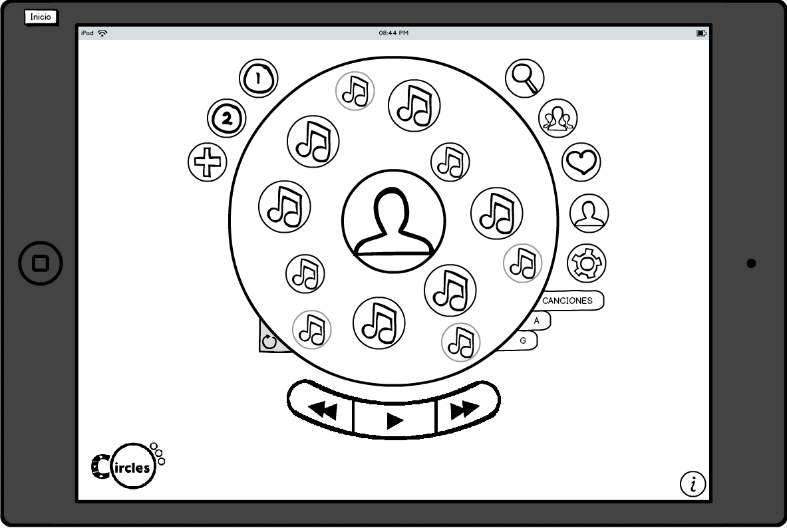
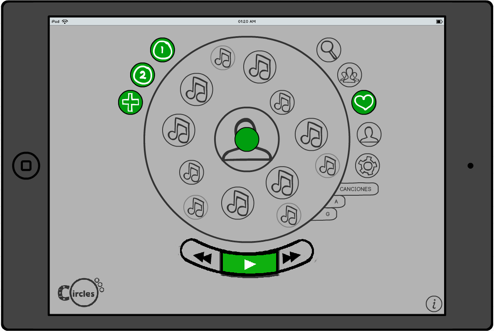
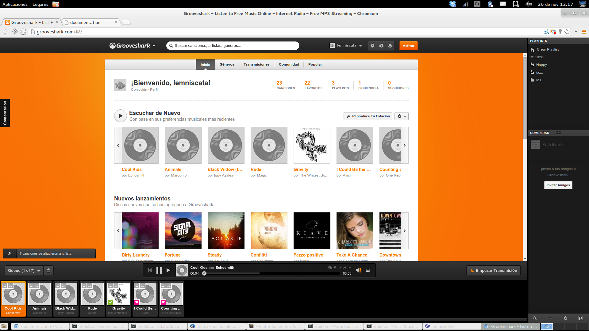
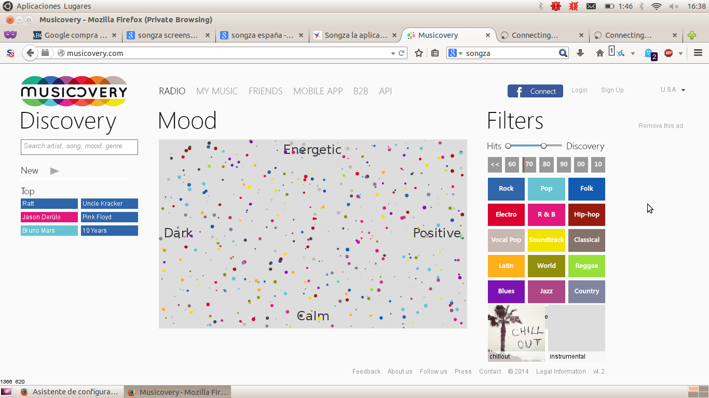

# Segundo prototipo de DSI
{:.no_toc}

* Table of contents
{:toc}

[test url](.{{ site.pages | where:"id","site-test" | map: "url" }})

## Personas

### Esqueletos




### Personas




Hemos diseñado y realizado el prototipo de una aplicación de música con una
interfaz novedosa orientada a tablets. Nos hemos basado en los siguientes
principios:

- **Recomendar**: Proponerte canciones nuevas.
- **Archivar**: Tener tus canciones y descubrimientos ordenados.
- **Ser social**: Compartir tus descubrimientos y listas.

Queríamos que en nuestra aplicación de un sólo vistazo pudieses identificar de
manera sencilla toda la información relevante para el usuario y que las
secciones estuviesen muy bien definidas, para no restar importancia a los
objetivos de la aplicación. El resultado de este proceso de diseño es la
siguiente interfaz:

Cómo se puede ver, nuestro diseño es circular y dividido en *sectores*, de
forma que cada sector representa un conjunto de funcionalidad. En el *centro*
tenemos la zona donde mostramos la información que el usuario ha solicitado,
de forma que **el de los elementos tamaño indica cómo de importante son**.

Otra parte importante es que buscábamos que la interfaz se enfocase en
recomendar de forma sencilla y limpia, que el usuario no estuviese saturado de
información. Debido a esto hemos cambiado la forma de interactuar con la
interfaz:

- No damos resultados exactos ni potenciamos el navegar por la discografía de
  un artista, si no que en el centro mostramos un **disco de
  recomendaciones**, así si el usuario busca un artista, le aparecerán
  canciones del artista y canciones que no son de él.

- Para ver más resultados no se navega, si no que se **descarta el disco de
  recomendaciones actual**. Para esto usamos una interacción especial con el
  centro, un swipe rápido con 2 dedos en el centro (como si lo estuvieses
  tirando). También hay un botón en la interfaz como ayuda si el usuario no
  conoce el gesto.

La interacción principal con los elementos es usando *drag and drop*, por que
con él puedes hacer de manera uniforme y muy rápida diversas acciones,
simplemente con arrastrarlo a distintos sitios. Cuando arrastras usamos una
mascara visual en la remarcamos los lugares a donde puede arrastrar, además de
posiblemente *pegamento*.

En general, de un vistazo se puede identificar fácilmente lo que estás viendo
una vez que comprendes la estructura de la aplicación y es muy rápido buscar
canciones y generar una lista de canciones nuevas.

Cómo la interfaz es novedosa tanto en la disposición de los menús cómo en las
interacciones con ella, hemos añadido en la esquina inferior un botón de
*información adicional y ayuda*, además de una pantalla de tutorial la primera
vez que abres la aplicación.

## Cambios en la interfaz

La interfaz de la primera práctica se ha mantenido en esencia, pero hemos
realizado algunas mejoras, tanto por el feedback que recibimos después de la
presentación, cómo por que hemos definido más concretamente el entorno en
donde nos movemos, tablets.

- **Definir claramente qué representa cada zona.** Teníamos definidos los
  diferentes sectores en la aplicación, pero no había información sobre qué
  representaba cada uno, de forma que era complicado encontrar para qué
  servían hasta que no empezabas a interactuar, para esto hemos añadido una
  pantalla de ayuda al principio.

- **Definir claramente los criterios de recomendación.** No explicábamos qué
  criterios de recomendación usábamos en la aplicación, de forma que el
  usuario podía confundirse o no entenderlo, ahora usamos el **criterio
  visual, el más grande se ve primero**.

- **Orientar la interacción a tablets.** Toda nuestra interacción estaba basa
  en *drag & drop* con ratón para un navegador, pero algunas interacciones
  como el scroll circular eran complicadas. En tablets estas interacciones son
  más intuitivas, pero hay que adaptar otras para este ecosistema.

- **Centrado en recomendar**: Reorientada la interacción a que la aplicación
  te de la información de qué canciones te pueden gustar, no a que tu busques
  los artistas y canciones en concreto.

- **Diferenciar claramente los tipos de resultados.** No quedó muy claro cómo
  diferenciamos entre qué era cada uno de los resultados en el centro. Para
  esto hemos añadido pestañas de categorías, y tu decides qué quieres ver.

## Elementos novedosos

Al desarrollar la aplicación estudiamos lo que estaba haciendo la competencia
del sector. Concretamente miramos [Grooveshark] y [Spotify]. Aquí tenemos una
captura de Grooveshark:

Cómo se puede ver, ya por su diseño ve vislumbra que el objetivo principal es
ser *reproductores de música* en el sentido más tradicional de escucharla.

### Nuestro concepto

Nuestra idea no era tanto ser un reproductor al uso, sino **recomendar
canciones nuevas** que el usuario no conozca y que pueda **clasificar y
ordenar sus descubrimientos**. Una aplicación que tiene un objetivo parecido
es [Musicovery].

Esta aplicación busca lo mismo que nosotros pero tiene una serie de
problemas:

- Interfaz muy sobrecargada con botones y colores
- Usa conceptos *vagos* como son las emociones (feliz, triste, energético...)
- No tienes posibilidad de elegir lo que qué escuchar ni cómo guiar la
  reproducción, sólo un botón de siguiente.

Para atajar el problema de cómo recomendar encontramos [Music-Map], una web en
la que a partir de un grupo de música, se genera un mapa de artistas y grupos
similares dispuestos por proximidad (cuanto más se parezcan más cercano
están). Aquí es donde nació la idea de usar *círculos en los que se disponga
la música más cerca cuanto más te guste*, de forma que sea fácil reconocer qué
canciones te pueden gustar más de un sólo vistazo.

Este concepto evolucionó por que en tablets, por el espacio no tan fácil de
reconocer, así que pasamos al concepto de *discos de recomendaciones*, con las
canciones dispuestas por tamaño.

Con todo esto, las novedades respecto a otras aplicaciones que hemos
introducido son:

- **Interfaz minimalista y simple**.

- **Descubrir música de forma muy visual y rápido**.

- **Mínimo necesario de información para que el usuario busque canciones nuevas**.

- **Todas las posibilidades de un reproductor al uso**.

- **Mostramos lo que al usuario le puede gustar**, no lo que el usuario busca exactamente.

Como un posible *contra* que tiene nuestra aplicación es que *no es
exhaustiva*, en el sentido de que no damos claramente resultados concretos y
el usuario no puede controlar exactamente lo que ve, lo que puede ser un
choque la primera vez si no estás lo sabías.

## Principios de diseño

### Principio de proximidad

La primera parte en la que aplicamos este principio es en la *división que
hacemos de nuestra interfaz*. Ésta está compuesta por muchos círculos, pero de
un vistazo puedes distinguir las distintas zonas y menús en los que está
compuesto.

Debido a la disposición que tenemos, las acciones posibles que se pueden hacer
con un elemento están repartidas por toda la interfaz. Cómo no queríamos
añadir elementos a la interfaz decidimos usar *drag and drop* como interacción
principal y que se arrastre a uno de los elementos ya existentes en la
interfaz. Esto va en contra del la *ley de Fitt*, por lo que habría que
estudiar cómo se comportaría en un tablet. Algunas ideas para mejorarlo es
usar pegamento, o que acciones como reproducir una canción baste con
arrastrarlo al sector de la pantalla correspondiente (en contraposición con
arrastrarlo al punto verde).

### Principio de consistencia

Nuestra interfaz es consistente internamente a nivel conceptual, ya que una
vez definidas y conocidas las metáforas y expresiones que usamos, toda la
interfaz funciona bajo los mismos principios.

#### Metáforas y expresiones

Nuestra metáfora principal es el **Disco de recomendaciones**: Una serie de
recomendaciones que te pueden gustar dispuestas en el disco central,
relacionadas con lo que está en el centro en ese momento.

En cuanto a las expresiones sobre esta metáfora:

- **Guardarte canciones del disco** en favoritos o listas.
- **Guardarte el disco** (todas sus canciones).
- **Descartar el disco** y que te recomienden otro (sólo se mantiene el
  centro).
- **Escuchar un disco**.
- **Escuchar algunas canciones del disco**.

#### Consistencia interna

En un nivel más visual, todos los elementos son círculos, que puedes arrastrar (nuestra forma de interactuar principal) o pinchar para expandirlos, de forma que una vez que haces esa asociación sabes lo que puedes hacer con todos los elementos.

#### Consistencia externa

Usamos acciones estándar como son el *swipe con 2 dedos* o *drag and drop*,
adaptándolos a nuestra metáfora. Este proceso de adaptación es el que puede
provocar mayor *fricción cognitiva*, pero una vez superado la interfaz creemos
que se hace muy fácil y rápida de usar.

Otro punto a tener en cuenta es que hemos mantenido conceptos del mundo de los
reproductores cómo *lista de reproducción*, *favoritos*, *géneros
musicales*... Por ejemplo, el reproductor de música está en la parte de abajo
para que las canciones vayan de izquierda a derecha, como esperarías por el
*mapeo mental* al que estamos acostumbrados (en algunos primeros diseños
estaba en los laterales)

### Principio de visibilidad y feedback

Los ejemplos más claro que tenemos en los que modificamos la interfaz para que el usuario sepa lo que está haciendo son:

- Al **arrastrar un elemento**, oscurecemos el fondo, marcamos las zonas donde
  puede dejarlo y el elemento lo mueves por la interfaz.

- Al **pulsar un elemento** de la interfaz, se selecciona y expande para ofrecerte
  más información.

Además de esto, intentamos dirigir la atención del usuario de forma visual a los elementos que nos interesan:

- Dándole sólo la información que queremos, por eso tenemos 5 zonas, cada una
  con cómo máximo unos 7-10 elementos.

- En el centro, los elementos más grandes son más visibles, como pista de que
  le pueden gustar más.

Sobre el feedback que se le da al usuario al finalizar algunas acciones, en
muchos casos será visual o sonoro o táctil, por ejemplo al añadir una canción
a una lista, el tablet puede vibrar, por lo que en este mockup no los hemos
tenido tanto en cuenta.

### Principio de Gestión del estado visible

No tenemos un **sistema de navegación** como tal, con lo que para que el
usuario sepa que es exactamente lo que está viendo usamos el centro, donde
mostramos de qué va la información del resto del disco central. Además no
existe el concepto de *has llegado por este camino*, así que no tenemos ni
*breadcrums* ni un botón de *volver atrás*

El **estado de la interfaz** lo mostramos de manera visual, usando el verde
cómo color especial para elementos seleccionas o remarcados. Además tenemos la
mascara del *drag and drop* que ayuda al usuario a saber lo que tiene que
hacer, y donde puede y no dejar los elementos.

En cuanto al **estado del modelo**, como no queríamos sobrecargar de
información al usuario y el mockup es muy simple, hay datos que no mostramos
en un principio, como cuantas canciones tiene una lista de reproducción, o si
una canción ya está o no en una lista de reproducción. Para distinguir esto
podríamos usar una guía de colores, pero se salía de nuestro prototipo.

### Principio de libertad y control del usuario

Este principio intentamos potenciarlo enseñándole al usuario que los resultados que ve en el *disco de recomendaciones* son volátiles, que no pasa nada por tirarlos, ya que hay más recomendaciones. Debido a esto no tenemos un botón de *volver atrás* para las recomendaciones.

Además, otra razón para no necesitar este botón y que aun así el usuario esté
cómodo jugando con la aplicación es que la mayor parte de las acciones son
reversible: si añades una canción puedes eliminarla, si sigues a un amigo
puedes dejar de hacerlo...

[Grooveshark]: <https://grooveshark.com>
[Spotify]: <https://play.spotify.com/>
[Musicovery]: <http://musicovery.com/>
[Music-Map]: <http://www.music-map.com/>
