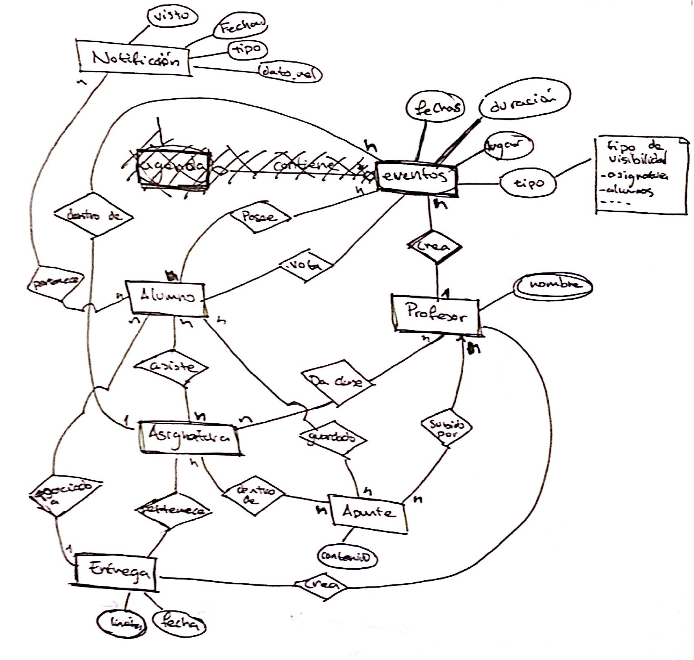

%% meta
% author: Pablo Cabeza
% title: [DSI] Cygnus interface
% description: An example of presentation
%% stylesheet
% css/style-2.css
% css/font-awesome.css
%%
% output-file: presentation.html
% self-contained

# Cygnus {rot-y=180 #first-step}

#  Aula virtual colaborativa { rot-y=180 .back-hidden}

## {.window-left-lists .list-unstyled}
- social: compartir
- alumno  crea contenido
- cómodo de usar
- supla carencias del campus virtual

# {#aula-virt-desc xy=-680,-500 rot=-45 data-rotate-y=180 .list-unstyled .back-hidden}

- antiguos alumnos sigan participando
- subir contenido extra
- participar en otros cursos y asignaturas

#  Aula virtual [colaborativa]<.crossed> {.back-hidden}

## {.window-left-lists .list-unstyled}

- [social: compartir]<.crossed>
- [alumno crea contenido]<.crossed>
- cómodo de usar
- supla carencias del campus virtual

# [Investigación]< .circle> { xy=4000,4000 rot=180}

# Análisis de la competencia { xy=3450,4000 rot=180}

# Campus virtuales { xy=3600,3950 rot=180 zoom=0.6}
# Trabajo colaborativo { xy=3600,3910 rot=180 zoom=0.6}

# Entrevistas y cuestionarios { xy=3630,4150 rot=165 zoom=0.6}

# Actores implicados { xy=3950,4230 rot=50 zoom=0.25 .list-unstyled .centered}

## {.two-columns}

### {.column-1}
- Futuro alumno
- Alumno actual
- Alumno antiguo

### {.column-2}
- Profesor antiguo
- Profesores jovenes

# [Entrevistas]<.white> {xy=4450,4100 rot=20 zoom=0.1 .list-unstyled}

- Alumno UNED
- Alumno Ingeniería
- Profesor joven

# Cuestionarios {xy=4460,4000 rot=180 zoom=0.1 .list-unstyled}

- uso del campus
- uso de tecnologías

# Conclusiones { xy=4270,4050 rot-y=180 data-rotate-z=180 zoom=0.6  }

[]

- demasiada funcionalidad
- no interés en todo lo propuesto
- restricciones: no todos los actores

# Modelado de personas { xy=8000,-10000 rot=270}

- modelo de cooper
- 10-12 variables por actor
- actores principales
  

	- **profesor**
	- **alumno**
  

# ¿Cuestionarios? { xy=8000,-11000 rot=270 .list-unstyled}

- `personas virtuales`
- clasificamos en el modelo de cooper

# <i class="fa fa-exclamation-triangle"></i> mucho ruido en alumnos { xy=8000,-12000 rot=270 .lg-offset-left-li }

- datos contradictorios
- datos irrelevantes

#  <i class="fa fa-exclamation-triangle"></i> <i class="fa fa-arrow-down"></i> datos = <i class="fa fa-arrow-down"></i> patrones { xy=8500,-12000 rot=270 .lg-offset-left-li}

- 2 entrevistas de alumnos...
- 1 entrevista de profesor...

# Personas obtenidas { xy=7000,-13000 rot=180 }

# Diego García { xy=6000,-13000 rot=180 .persona }

<h1 class="show">Diego García</h1>
[]

[Alumno universitario]

## {.resto}
- usa el cv para material del profesor
- habla con el profesor directamente
- sobre todo revisa notificaciones

# Eva María { xy=4500,-13000 rot=180 .persona }

<h1 class="show">Eva María</h1>
[]

[Profesora experimentada]

## {.resto}
- muchos años de docencia
- usa poco la tecnología
- usa el cv para subir apuntes

# Juan Martín { xy=3000,-13000 rot=180 .persona }

<h1 class="show">Juan Martín</h1>
[]

[Profesora joven]

## {.resto}
- uso cotidianas el ordenador
- prepara y sube su material
- revisa el correo y cv a menudo

# { xy=3000,-13000 rot=180 zoom=5  }

## Entrevistas {#entrevistas-1 .list-unstyled}
- 2 Alumnos 
- 1 Profesor

## Personas {#personas-1 .list-unstyled}
- 1 Alumno
- 2 Profesores

# ¿Por qué? { xy=8000,8000 rot=270}

## { .md-offset-left}
- cuestionarios de profesores <i class="fa fa-check"></i>
- cuestionarios de alumnos <i class="fa fa-times"></i>

## {.list-unstyled  .sm-offset-top}
- 2 *profesores virtuales* extras

# Conclusiones { xy=8000,6500 rot=270 }

# No se quiere colaboración <i class="fa fa-frown-o"></i> { z=1000 zoom=10 }

## ¡¿Ahora qué?! { style="text-align: center;" }

#  { yz=3000,1000 zoom=10 }
## A donde nos lleve la UX...

#  { xy=10000,10000 rot=180}
## Problemas/visiones {style="text-align: center;"} 
## y {style="text-align: center;"}
## Requisitos { style="text-align: center;"} 

# Diego { xy=10000,7900 rot=180 .big}

# No perderse nada nuevo { xy=10000,7800 rot=180 .normal}
# No se le pasen entregas { xy=10000,7750 rot=180 .normal}
# Poder subir y bajar documentos rápido { xy=10000,7700 rot=180 .normal .normal}

# Eva y Juan { xy=10000,6000 rot=180 .big}

# Subir apuntes y reutilizarlos { xy=10000,5850 rot=180 .normal}
# Organizar clases, tutorías,... { xy=10000,5800 rot=180 .normal }
# Calificar y corregir { xy=10000,5750 rot=180 .normal}

  

# Framework de diseño {x=20000 .big}

# Aprox. 2 iteraciones {xy=20100,100}
# [¿!Aproximadamente?!]<.drop> {xy=20100,100 style="margin-top:100px;"}
# [Trabajado sin segmentar]<.drop> {xy=20100,100 style="margin-top:200px;"}

# Primera iteración {xz=20800,-1000 rot=-90 .big}

# Bocetos iniciales {xz=20900,-1000 rot=-90 .md-offset-left}
# {xz=22900,-1000 rot=-90  .img .back-hidden}

# Elementos de datos {xz=20970,-1000 rot=-90 .md-offset-left}
# {xz=23900,-1000 rot=-90  .img .back-hidden}

# Elementos visuales {xz=21040,-1000 rot=-90 .md-offset-left}

# [Puesta en común]<.drop> { xyz=20800,-400,-1300 rot=-150 }

# Segunda iteración {xyz=20900,-800,-2000 rot=-180 .big}

# Datos y funcional refinados {xyz=20900,-900,-2000 rot=-180 .md-offset-left}
# {xyz=20900,-2900,-2000 rot=-180 .md-offset-left}

# Bocetos y mockup pencil {xyz=20900,-970,-2000 rot=-180 .md-offset-left}

# Implementación { x=-10000 .big}
# Prototipo Axure  {xy=-10000,200 }
# Evaluaciones heurísticas {xy=-10000,400 }
- 2 evaluadores
- Observaciones de uso
- Mejoras al diseño

# Prototipo de alta fidelidad {xy=-20000,-300 }

# {x=-20000}
<video width="800px"  controls>
	<!-- <source src="video.avi" type="video/avi"> -->
	<source src="video.mp4" type="video/mp4">
Your browser does not support the video tag.
</video>

<!--
1. Bocetos iniciales
2. Datos
3. Funcionales

4. Puesta en común

5. Datos
6. Funcional

5. b) Boceto 2

7. Puesta en comun y mockup axure
8. Evaluaciones heurísticas
9. Decisiones de mejoras
10. Prototipo de alto nivel
-->
